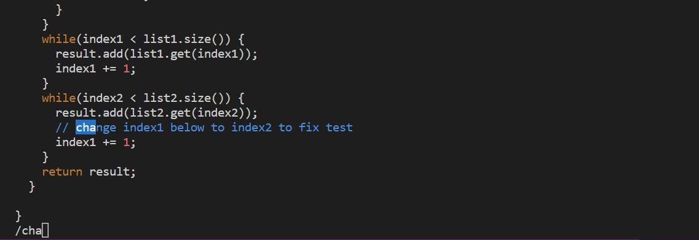

CS15L-LabReport-4
========


**Log into ieng6**
 
 ````
 $ssh cs15lsp23nz@ieng6.ucsd.edu
 ````
  
 
  
  - The command above log into my ieng6 account because I have generated the public and private key pair in lab. This allows me to skip the password input to the ieng6 server. Once the terminal detects the login attempt, the server will find the public key as approved. Then, my local computer will prove ownership to the corresponding private key. Therefore, I could login to ieng6 without manual authentication.

**Clone your fork of the repository from your Github account**

  ````
    $git clone git@github.com:leftPathGoat/lab7.git
  ````
 
 
  - The git command clone the repository using ssh key at `git@github.com:leftPathGoat/lab7.git`.The previous setup from lab allows me to use SSH and HTTPS.
  
**Run the tests, demonstrating that they fail**
  ````
    $cd lab7 
    $ls
    $bash test.sh
  ````
 
 
 - The `$cd lab7` command change my directory to the lab7 folder. Then `$ls` shows all the files in the lab7 folder. When I run bash script `$bash test.sh`, the script compiles all the java file, and execute the jUnit test `ListExampleTest.class`. 
 
 - By using `$cat test.sh`, we can look at the content from `test.sh`.  
 
  
**Edit the code file to fix the failing test**
 
 
````
$vim ListExamples.java
````

- The command vim open the file `istExamples.java` and allows me to edit the file.
> key pressed:
  `/cha <enter>`
  
  - I used `/` to search for `cha` because I know this would direct my cursor to the line above where error occured. As the image shown, the character `cha` is highlighted. The `<enter>` confirm my cursor location and return to normal mode. 
  
> key pressed:
  `<down> <right> <right> r 2 <enter>`
  
  - I used arrow keys to navigate to the line where error occured. Then, I pressed `r` which allows me to replace the character under my cursor. The following `2` replace the character under my cursor to `2`. At last, I pressed `<enter>` to confirm the command. 
> key pressed:
  `:wq <enter>`
  
 
  - In normal mode, I pressed `:wq` to write and quit the vim. This command allows me to save the changes and exit to terminal. 
  
  - This is what the terminal looks like after exiting vim.
  
**Run the tests, demonstrating that they now succeed**
  `$bash test.sh <enter>`
  
  
  - I ran `test.sh` again. This time all the test passed indicating the bug has been fixed.
  
**Commit and push the resulting change to your Github account (you can pick any commit message!)**
  ````
  $git add *.java
  $git commit -m "Commit all the *.java files"
  <enter>
  ````
  
  
  - The `git add *java` command added all the java files. Then, `git commit` commit the changes to the local files. The `-m` allows me to add a message to the commit. 
  
  `$git push <enter>`
  
  
  
  - The `push` command upload the changes from `git commit` to the github repository.

**See the changes**
  
  
  
  - We can see the changes on my github repository. The file `ListExamples.java` has the commit message and the time stamp.

